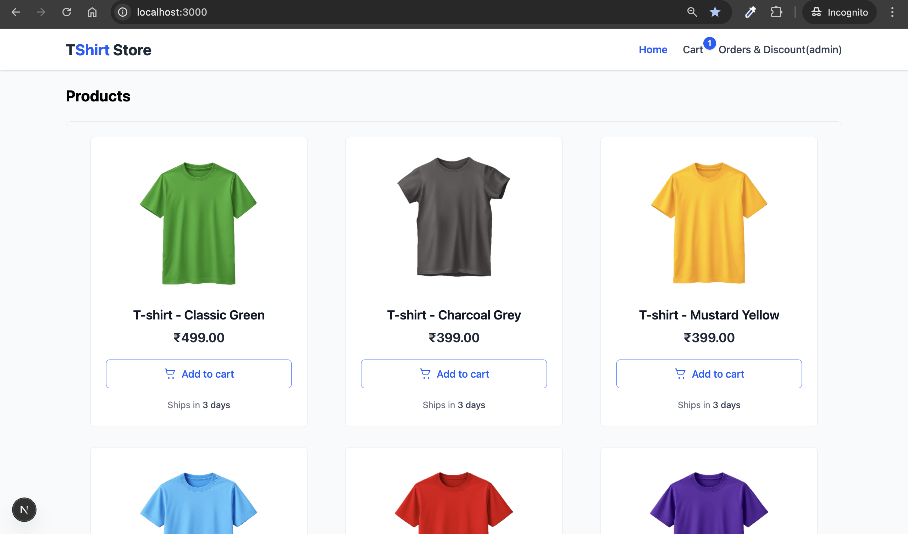
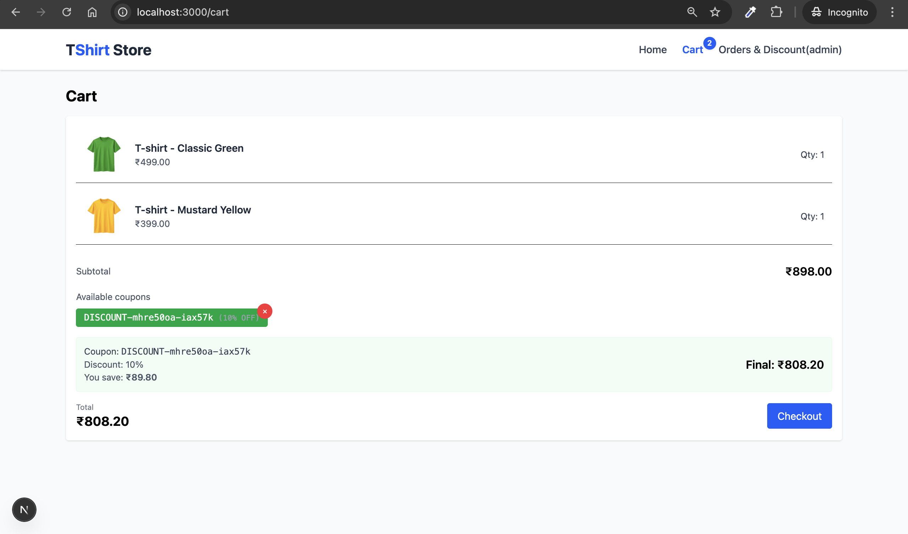
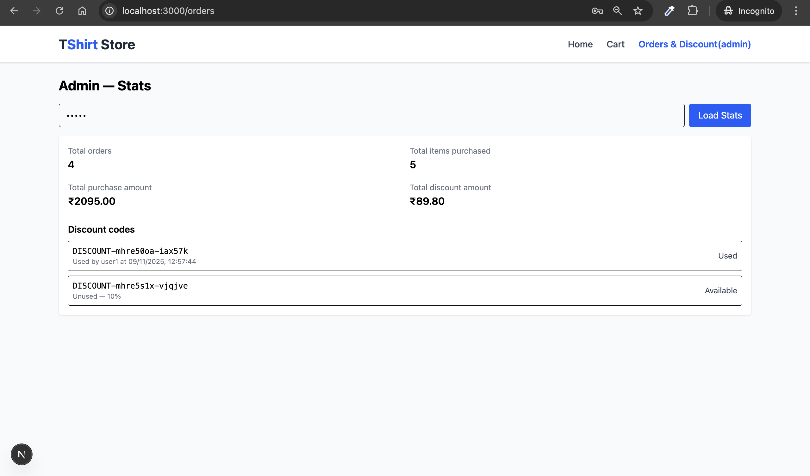

# 🛍️ E-Commerce Store — Next.js (React + TypeScript)

A modern **E-Commerce Web App** built using **Next.js (App Router)**, **React**, **TypeScript**, and **Tailwind CSS**.  
It demonstrates full-stack features including cart management, checkout flow, dynamic discount logic, and an admin dashboard — all within a clean, scalable architecture.

---

## 🚀 Features

### 🧑‍💻 User

- Add items to cart from the **Home Page**
- View and update the cart at **/cart**
- Checkout and place an order
- Receive a **10% discount coupon** automatically on every _nth_ (2nd) order
- Apply or remove discount codes easily

### 🧑‍💼 Admin

- Access the **Admin Dashboard** at **/orders**
- View:
  - Total Orders
  - Total Items Purchased
  - Total Purchase Amount
  - Total Discount Amount
  - All Generated Discount Codes (used / available)
- Admin access key: **`12345`**

---

## 🧩 Tech Stack

| Layer      | Technology                                    |
| ---------- | --------------------------------------------- |
| Framework  | [Next.js 14 (App Router)](https://nextjs.org) |
| Language   | TypeScript                                    |
| UI Library | React.js                                      |
| Styling    | Tailwind CSS                                  |
| API Routes | Next.js Route Handlers (`app/api/*`)          |
| Data Store | In-memory (via `lib/store.ts`)                |

---

## 📁 Folder Structure

```bash
.
├── app/
│   ├── api/              # Backend APIs (cart, checkout, admin, etc.)
│   ├── cart/             # Cart page (user)
│   ├── orders/           # Admin dashboard
│   └── page.tsx          # Home page (product listing)
├── components/           # Reusable UI components
│   ├── Header.tsx
│   ├── ProductCard.tsx
│   └── CartItem.tsx
├── lib/
│   └── store.ts          # In-memory store for items, carts, orders, coupons
├── public/images/        # Product images
├── screenshots/          # App screenshots
└── README.md
```

## 🖼️ Screenshots

| Page                   | Preview                                                 |
| ---------------------- | ------------------------------------------------------- |
| 🏠 **Home Page**       |   |
| 🛒 **Cart Page**       |   |
| 📊 **Admin Dashboard** |  |

---

## ⚙️ Getting Started

Follow these steps to run the project locally 👇

### Install Dependencies

```bash
npm install
```

### Start the Development Server

```bash
npm run dev
```

### Open in Browser

Go to http://localhost:3000
